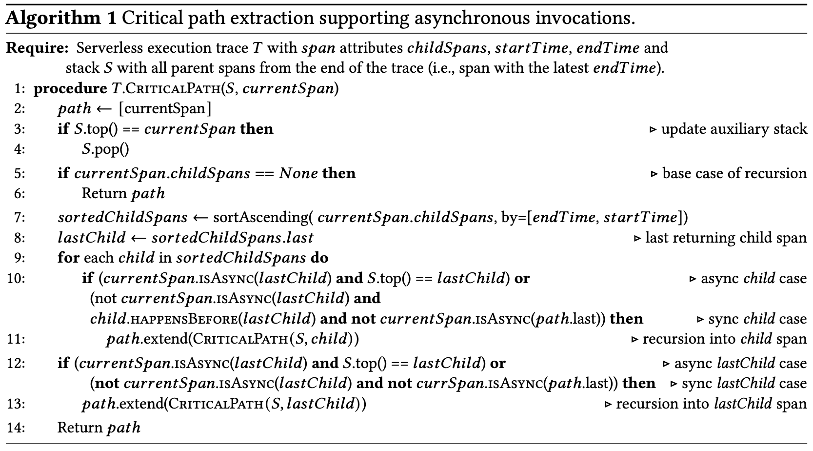

# Serverless Benchmarker

The Serverless Benchmarker (sb) is a meta-benchmarking tool to orchestrate reproducible serverless application benchmarking.

* **Reproducible deployments**: sb abstracts away dependencies using Docker and automatically mounts application code and credentials (when needed) into the right container directories.
* **Automated load generation**: sb provides different classes of invocation patterns derived from real-world traces. It integrates with the open source load testing tool [k6](https://k6.io/).
* **Clear box application insights**: for instrumented applications, sb implements detailed trace analysis using distributed tracing such as [AWS X-Ray](https://aws.amazon.com/xray/) and [Azure Application Insights](https://docs.microsoft.com/en-us/azure/azure-monitor/app/distributed-tracing).

## Quicklinks

* [Detailed Installation Instructions for AWS EC2](./docs/LOADGENERATOR.md)
* [Development](./docs/DEVELOPMENT.md)
* [FAQ](./docs/FAQ.md)

## Quick Setup

1. Install [Docker](https://docs.docker.com/get-docker/) 19.03+
2. Install [Python](https://www.python.org/downloads/) 3.7+ (tested with 3.7, 3.8. 3.9, 3.10)

    > ARM-based Apple M1 systems are not yet fully supported. The trace analyzer works with Python 3.10 but the Docker integration can cause some problems with certain applications.

3. Install the `sb` tool:

    a) [pipx](https://packaging.python.org/guides/installing-stand-alone-command-line-tools/) (recommended for CLI)

    ```bash
    python3 -m pip install --upgrade pip
    python3 -m pip install --user pipx
    python3 -m pipx ensurepath  # might require terminal restart
    cd serverless-benchmarker
    pipx install --editable .
    ```

    b) [venv](https://docs.python.org/3/library/venv.html) (required for SDK when using the programmatic API)

    ```bash
    python3 -m venv sb-env
    source sb-env/bin/activate  # depends on shell
    cd serverless-benchmarker
    python3 -m pip install --upgrade pip
    pip install --editable .
    ```

4. Build the sb Dockerfile via `sb init`
5. Login for providers via `sb login PROVIDER`: Supported for [aws](./docs/AWS.md), [azure](./docs/AZURE.md), `google`, `ibm`.

## Credentials

The credentials are stored in a Docker volume called `PROVIDER-secrets` (e.g., `aws-secrets`) and selectively mounted when needed. They can be deleted via `sb logout PROVIDER`.
Check credentials via `sb check_credentials PROVIDER`

## Getting Started

```sh
# Run empty mock benchmark locally
sb test --file=tests/fixtures/mock_benchmark/mock_benchmark.py

# Get an AWS and Azure app
# AWS
cd faas-migration/ThumbnailGenerator/Lambda
# Azure
cd faas-migration/ThumbnailGenerator/Azure

# Benchmarking lifecycle using a `*_benchmark.py` file:
# 1) Deploy app
sb prepare
# 2a) Invoke app a single time
sb invoke
# 2b) Invoke app 10 times sequentially
sb invoke 10
# 2c) Benchmark with a pre-configured workload_type (steady|bursty|spikes|jump)
sb invoke bursty
# 3) Download traces
sb get_traces
# 4) Analyze latest traces
sb analyze_traces
# Hint for analyzing previous traces: sb analyze_traces logs/DATETIME/traces.json
# 5) Cleanup all cloud infrastructure
sb cleanup
```

*Hints:*

* `*_benchmark.py` files in the current working directory are automatically detected (if only a single file exists).
* `sb test` sequentially executes prepare, invoke (with workload_type=3) and, cleanup.
* `sb invoke custom_per_minute_rate_trace.csv` supports custom CSV workload traces.
* Checkout the [AWS X-Ray Console](https://console.aws.amazon.com/xray/home) for result traces (6h retention!) or [CloudWatch logs](https://console.aws.amazon.com/cloudwatch).

## Critical Path Extraction for Asynchronous Invocations

To extract the critical path, we use Algorithm 1, which is a modified version of the weighted longest-path algorithm proposed for microservices at OSDI'20 in the paper [FIRM: An Intelligent Fine-grained Resource Management Framework for SLO-Oriented Microservices](https://www.usenix.org/conference/osdi20/presentation/qiu) (Qiu et al.).



We re-implement their algorithm and provide a few test cases that demonstrate some limitations.
We fix an ordering bug and show that it cannot handle asynchronous invocations in serverless traces.

We provide the following implementations:

* [**critical_path_algorithm_async.py**](sb/critical_path_algorithm_async.py)
  * Our Algorithm 1 with extensive documentation.
  * Description of high-level algorithm.
  * Challenges and solutions we use to solve them (e.g., related to timing).
  * Detailed line-by-line explanations, sometimes proving alternative Python implementations and direct mappings to the algorithm in the paper.
  
* [critical_path_algorithm_async_test.py](tests/unit/critical_path_algorithm_async_test.py)
  * Test cases for Algorithm 1
* [critical_path_algorithm_sync.py](sb/critical_path_algorithm_sync.py)
  * Fixed version of original algorithm by Qiu et al.
* [critical_path_algorithm_sync_test.py](sb/critical_path_algorithm_sync_test.py)
  * Failing test cases for original algorithm
  
## Debugging

* `sb shell IMAGE` starts an interactive shell with all auto-mounts in a given Docker IMAGE.
* More examples of `*_benchmark.py` files are available under `tests/fixtures` (covered by integration tests)
* Insert the code `import code; code.interact(local=dict(globals(), **locals()))` on any line to prompt an interactive Python shell.
* Checkout the [DEVELOPMENT](docs/DEVELOPMENT.md) docs for more details.

## Updates

1. Pull the latest version `git pull origin master`
2. If `setup.py` changed
    1. Re-install dependencies via `pipx install --editable .` or `pip install --editable .`
    2. Re-build the Dockerfile via `sb init`

NOTE: We can simplify this process and installation after releasing sb publicly.

## Add your Application

1. Create a `*_benchmark.py` file in the main directory of your application.
2. Implement hooks for `prepare(spec)`, `invoke(spec)`, and `cleanup(spec)` as shown under [mock_benchmark.py](./tests/fixtures/mock_benchmark/mock_benchmark.py). Key functionality:
    * `spec.run(CMD, image=DOCKERIMAGE)` Runs a given CMD in a DOCKERIMAGE and returns its stdout.
    * `spec.build(IMAGE_TAG)` Builds a Dockerfile and tags it with IMAGE_TAG.
    * `spec['KEY']` provides a persistent key-value store across different benchmark cycles (e.g., share state between prepare and invoke)
    * The `BENCHMARK_CONFIG` constant initializes the key-value store and specifies configurable attributes (e.g., region) and meta-information (e.g., provider).
    * The working directory is defined by the location of `*_benchmark.py` (i.e., same directory).
    * sb mounts the working directory by default into any Docker container. If files at higher levels are required, the `root` benchmark config allows to mount higher level directories (e.g., parent using `..`).
    * sb integrates with [k6](https://k6.io/) for load testing.
    * `sb invoke` automatically generates a `workload_options.json` file with [k6 options](https://k6.io/docs/using-k6/options).
    * `sb invoke` and `sb get_traces` automatically create logs in the working directory under `logs` with the start timestamp of the invocation.
3. Instrument your application (provider- and language-dependent):
    * AWS: Enable X-Ray tracing and add language-specific instrumentation as described [here](https://docs.aws.amazon.com/lambda/latest/dg/services-xray.html).
    * Azure: TODO(clarify how to use [Azure Insights](https://docs.microsoft.com/en-us/azure/azure-monitor/app/app-insights-overview) metrics for [distributed tracing](https://docs.microsoft.com/en-us/azure/azure-monitor/app/distributed-tracing))
